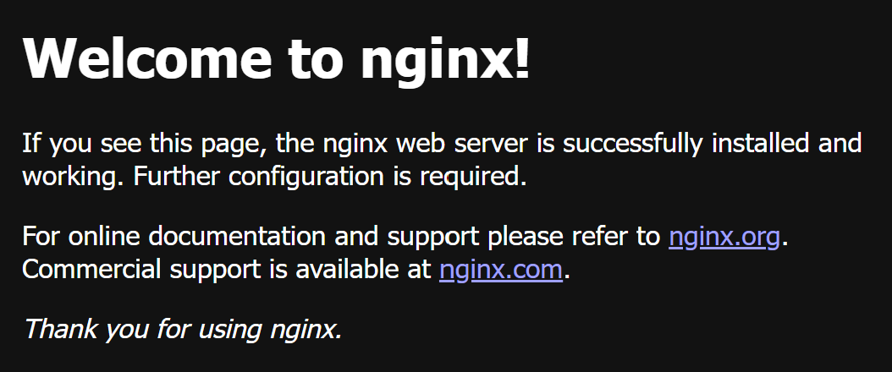
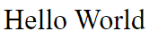
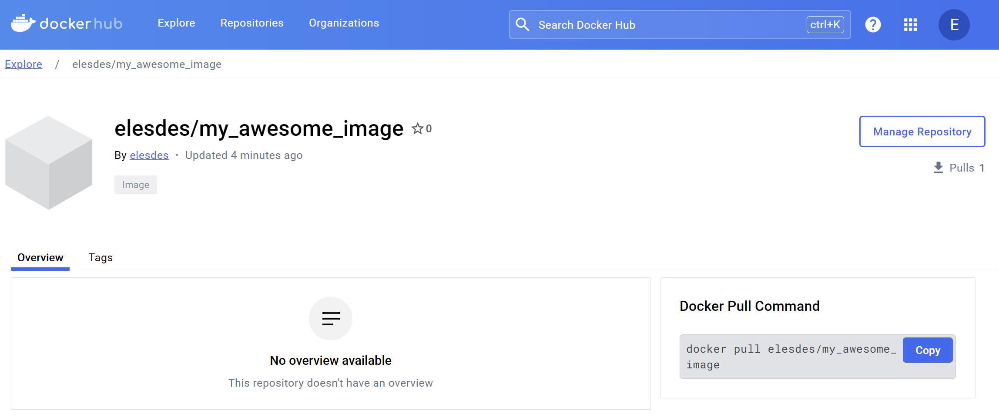
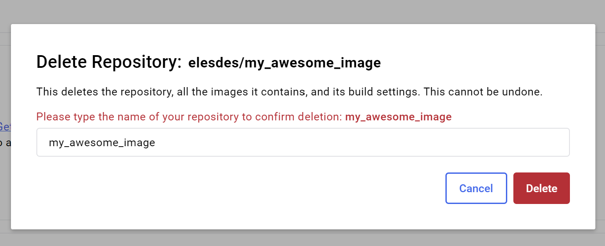

# Lab 2 - Your first docker images
## Create a transitive image
### Tips

- Use the `docker commit`

### Make our image

1. Run `nginx` image detached with param `-p 80:80` named `mynginx1`
   ```bash
   docker run -d -p 80:80 --name mynginx1 nginx
   ```
2. Check that the nginx page (localhost:80)

3. Run a shell without stopping the Container
   ```bash
   docker exec -it mynginx1 /bin/bash
   ```
4. Update the file `/usr/share/nginx/html/index.html` in the container
   ```bash
   echo "My Custom Page" > /usr/share/nginx/html/index.html
   ```
5. Check that the nginx page has been updated (localhost:80)<br>

6. Create a transitive image named `my_awsome_image`
   ```bash
   docker commit mynginx1 my_awesome_image
   ```
7. Run the new image
   ```bash
   docker run -d -p 8080:80 --name my_awesome_container my_awesome_image
   ```
8. Check that the modifications are still present (localhost:80)<br>

9. Check the layer with the `docker history` command
   ```bash
   docker history my_awesome_image
   ```
   Output:
   ```bash
   IMAGE          CREATED         CREATED BY                                      SIZE      COMMENT
   6ad120866fd6   3 minutes ago   nginx -g daemon off;                            1.26kB    
   92b11f67642b   7 weeks ago     CMD ["nginx" "-g" "daemon off;"]                0B        buildkit.dockerfile.v0
   <missing>      7 weeks ago     STOPSIGNAL SIGQUIT                              0B        buildkit.dockerfile.v0
   <missing>      7 weeks ago     EXPOSE map[80/tcp:{}]                           0B        buildkit.dockerfile.v0
   <missing>      7 weeks ago     ENTRYPOINT ["/docker-entrypoint.sh"]            0B        buildkit.dockerfile.v0
   <missing>      7 weeks ago     COPY 30-tune-worker-processes.sh /docker-ent…   4.62kB    buildkit.dockerfile.v0
   <missing>      7 weeks ago     COPY 20-envsubst-on-templates.sh /docker-ent…   3.02kB    buildkit.dockerfile.v0
   <missing>      7 weeks ago     COPY 15-local-resolvers.envsh /docker-entryp…   336B      buildkit.dockerfile.v0
   <missing>      7 weeks ago     COPY 10-listen-on-ipv6-by-default.sh /docker…   2.12kB    buildkit.dockerfile.v0
   <missing>      7 weeks ago     COPY docker-entrypoint.sh / # buildkit          1.62kB    buildkit.dockerfile.v0
   <missing>      7 weeks ago     RUN /bin/sh -c set -x     && groupadd --syst…   112MB     buildkit.dockerfile.v0
   <missing>      7 weeks ago     ENV PKG_RELEASE=1~bookworm                      0B        buildkit.dockerfile.v0
   <missing>      7 weeks ago     ENV NJS_VERSION=0.8.3                           0B        buildkit.dockerfile.v0
   <missing>      7 weeks ago     ENV NGINX_VERSION=1.25.4                        0B        buildkit.dockerfile.v0
   <missing>      7 weeks ago     LABEL maintainer=NGINX Docker Maintainers <d…   0B        buildkit.dockerfile.v0
   <missing>      7 weeks ago     /bin/sh -c #(nop)  CMD ["bash"]                 0B        
   <missing>      7 weeks ago     /bin/sh -c #(nop) ADD file:b86ae1c7ca3586d8f…   74.8MB
   ```

### Upload our image

1. Tag your image with the tag `<dockerHubId>/my_awsome_image:1.0`
   ```bash
   docker tag my_awesome_image elesdes/my_awesome_image:1.0
   ```
2. List your docker images
   ```
   docker images
   ```
   1. What do you see ?
      ```bash
      REPOSITORY                 TAG       IMAGE ID       CREATED         SIZE
      elesdes/my_awesome_image   1.0       6ad120866fd6   6 minutes ago   187MB
      my_awesome_image           latest    6ad120866fd6   6 minutes ago   187MB
      nginx                      latest    92b11f67642b   7 weeks ago     187MB
      ```
3. Use the CLI to log into your docker account
   ```bash
   docker login
   ```
4. Push your image<br>
   ```bash
   docker push elesdes/my_awesome_image:1.0
   ```
5. Check that your image is available on `https://hub.docker.com/r/elesdes/my_awesome_image`

6. Delete the repository `https://hub.docker.com/repository/docker/elesdes/my_awesome_image/settings`
