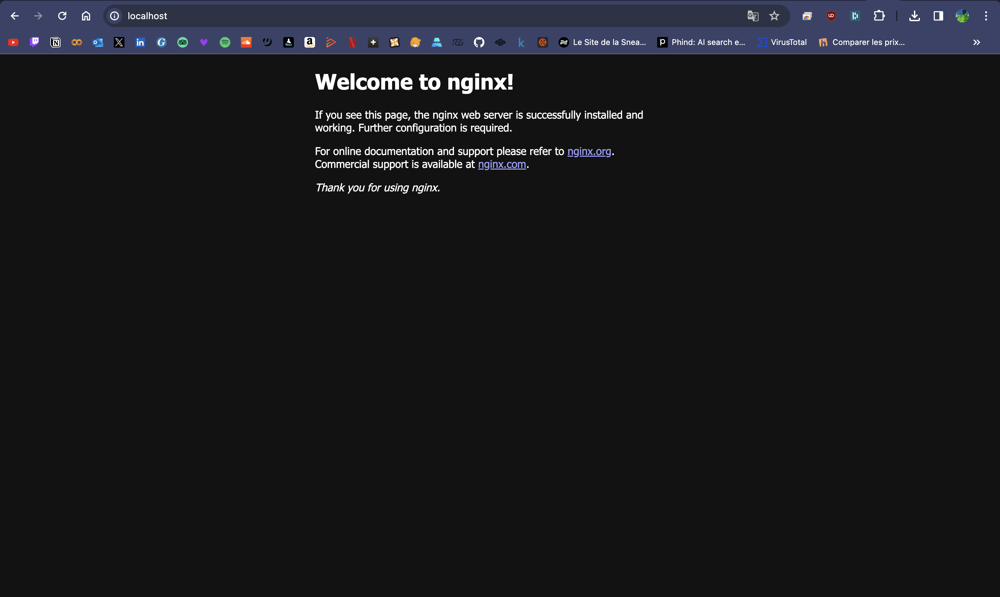
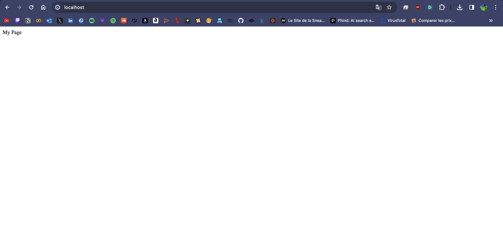
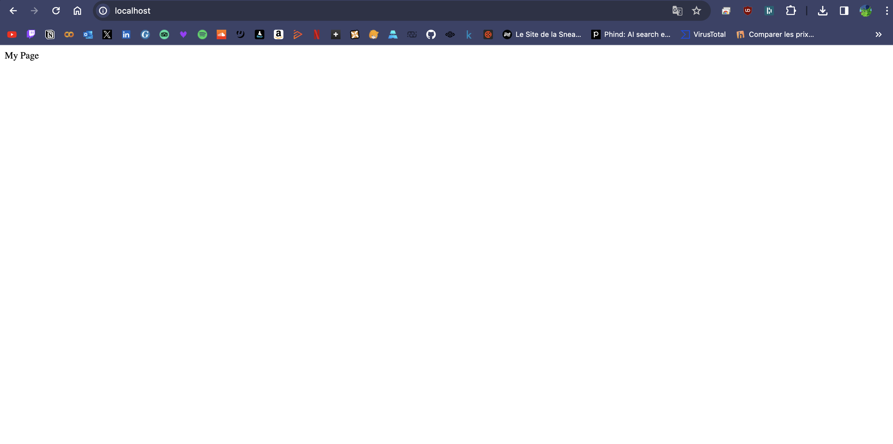
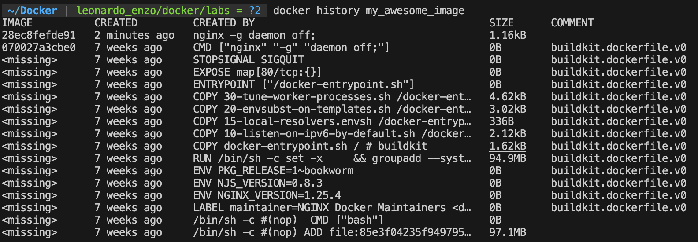
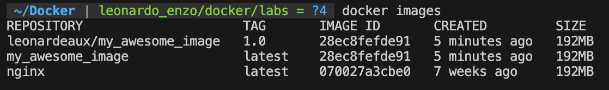
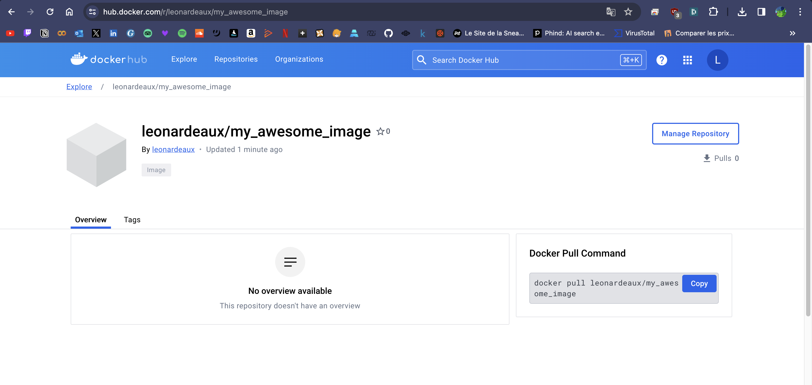
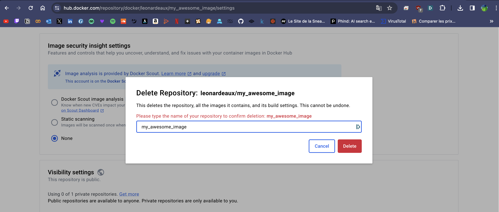

# Lab 2 - Your first docker images

## Create a transitive image

### Tips

- Use the `docker commit`

### Make our image

1. Run `nginx` image detached with param `-p 80:80` named `mynginx1` 
Terminal: docker run -d -p 80:80 --name mynginx1 nginx
2. Check that the nginx page (localhost:80)

3. Run a shell without stopping the Container 
Terminal: docker exec -it mynginx1 /bin/bash
4. Update the file `/usr/share/nginx/html/index.html` in the container 
Terminal: # echo "My Page" > /usr/share/nginx/html/index.html
5. Check that the nginx page has been updated (localhost:80)

6. Create a transitive image named `my_awsome_image` 
Terminal: docker commit mynginx1 my_awesome_image
7. Run the new image 
Terminal: docker run -d -p 8080:80 --name my_awesome_container my_awesome_image
8. Check that the modifications are still present (localhost:80)

9. Check the layer with the `docker history` command 
Terminal: docker history my_awesome_image 
Terminal Result: 

### Upload our image

1. Tag your image with the tag `<dockerHubId>/my_awsome_image:1.0` 
Terminal: docker tag my_awesome_image kuramathi/my_awesome_image:1.0
2. List your docker images 
Terminal: docker images 
   1. What do you see ?
   
3. Use the CLI to log into your docker account 
Terminal: docker login 
4. Push your image
Command: docker push kuramathi/my_awesome_image:1.0 
5. Check that your image is available on `https://hub.docker.com/r/leonardeaux/my_awesome_image`

6. Delete the repository `https://hub.docker.com/repository/docker/leonardeaux/my_awesome_image/settings`
