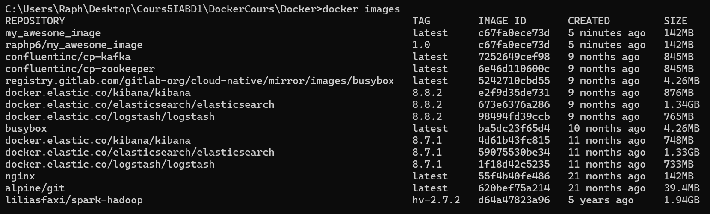

# Lab 2 - Your first docker images
## Create a transitive image
### Tips

- Use the `docker commit`

### Make our image

1. Run `nginx` image detached with param `-p 80:80` named `mynginx1`
Command: docker run -d -p 80:80 --name mynginx1 nginx
2. Check that the nginx page (localhost:80)

3. Run a shell without stopping the Container 
Command: docker exec -it mynginx1 /bin/bash 
4. Update the file `/usr/share/nginx/html/index.html` in the container
# echo "My Custom Page" > /usr/share/nginx/html/index.html
5. Check that the nginx page has been updated (localhost:80) 
 
6. Create a transitive image named `my_awsome_image` 
Command: docker commit mynginx1 my_awesome_image 
7. Run the new image 
Command: docker run -d -p 8080:80 --name my_awesome_container my_awesome_image 
8. Check that the modifications are still present (localhost:80) 
 
9. Check the layer with the `docker history` command 
Command: docker history my_awesome_image 
Result :  
 

### Upload our image

1. Tag your image with the tag `<dockerHubId>/my_awsome_image:1.0` 
Command: docker tag my_awesome_image kuramathi/my_awesome_image:1.0 
2. List your docker images 
Command: docker images 
   1. What do you see ? 
    
3. Use the CLI to log into your docker account 
Command: docker login 
4. Push your image 
Command: docker push kuramathi/my_awesome_image:1.0 
5. Check that your image is available on `https://hub.docker.com/repository/docker/kuramathi/my_awsome_image/` 
 
6. Delete the repository `https://hub.docker.com/repository/docker/<dockerHubId>/my_awsome_image/settings` 
 