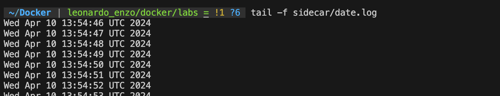

# Lab 4 - Volumes

## Use volumes

### Tips

- Use `docker container inspect ...`

### Existing volumes

1. run `docker container run --name couchdb -d -p 5984:5984 couchdb:2.1`
2. Check existing volumes 
Terminal: docker volume ls 
   1. Why there is already a volume ?
   The CouchDB image is designed to store its data in a volume
3. Identify the volume that is used by `couchdb` 
Terminal: docker container inspect couchdb  
At the mount part:

4. Mount the identified volume to busybox
Terminal: docker run -it --rm --volumes-from couchdb busybox
5. Check files inside `/opt/couchdb/data`

6. Stop couchdb
Terminal: docker stop couchdb
Terminal: docker container rm couchdb
7. Delete the volume
docker volume rm d7a66751c87f5e943d50b26d9d2d9eda9566117fd4913fe1ff0e0e19abc132af
8. Check that the volume has been deleted
Terminal: docker volume ls
DRIVER    VOLUME NAME

### Create a named volume

1. Create a volume named : `couchdb_vol`
Terminal: docker volume create couchdb_vol
2. Run `couchedb` with the created volume
Terminal: docker run --name couchdb -d -p 5984:5984 -v couchdb_vol:/opt/couchdb/data couchdb:2.1
3. Inspect the container and look at `Mounts` that `couchdb_vol` is used

### Mount directory

1. Mount `/var/lib/docker` from host to `/dck` into a busybox container 
Terminal: docker run -it --rm -v /var/lib/docker:/dck busybox
2. Check at `ls /dck/volumes/couchdb_vol/_data` inside the container to verify that `couchdb_vol` is available

### SideCar Pattern

1. Create a directory named `sidecar` with `mkdir`
2. Run Busybox
   1. Command: `sh -c 'while true; do date >> /dck/date.log; sleep 1; done'`
   2. Volume to mount: `$(pwd)/sidecar:/dck`
   3. Name: `gen_date`
   4. State: detached
   Terminal: docker run -d --name gen_date -v $(pwd)/sidecar:/dck busybox sh -c 'while true; do date >> /dck/date.log; sleep 1; done'
3. Check the content of `sidecar/date.log` with `cat`

4. Run Busybox
   1. Command: `tail -f /dck2/date.log`
   2. Volume to mount: `$(pwd)/sidecar:/dck2`
   3. State: attached
   Terminal: docker run -it --name get_date -v $(pwd)/sidecar:/dck2 busybox tail -f /dck2/date.log
   
5. Check content of `dck2/date.log` with `tail -f`

6. Exit container
7. Run `docker kill gen_date`
   1. Why is the container stoped ?
   Because docker kill the current process but not the container

### In memory 

1. Run busybox with `--tmpfs /test`
Terminal: docker run -it --rm --tmpfs /test busybox
2. Check with `mount | grep test` that tmpfs is used

