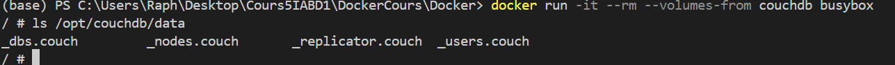
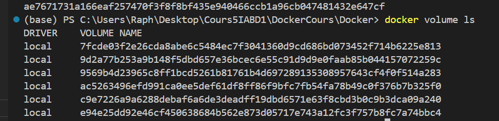
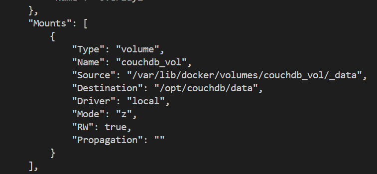
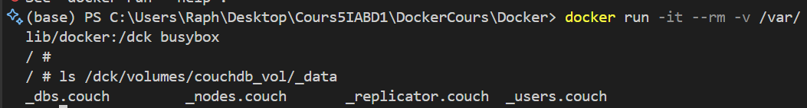

# Lab 4 - Volumes

## Use volumes

### Tips

- Use `docker container inspect ...`

### Existing volumes

1. run `docker container run --name couchdb -d -p 5984:5984 couchdb:2.1`
2. Check existing volumes
docker volume ls
   1. Why there is already a volume ?
   because the first command create the volume
3. Identify the volume that is used by `couchdb`
docker container inspect couchdb
4. Mount the identified volume to busybox
docker run -it --rm --volume -from couchdb busybox
5. Check files inside `/opt/couchdb/data`

6. Stop couchdb
docker stop couchdb
docker container rm couchdb
7. Delete the volume
docker volume rm ae7671731a166eaf257470f3f8f8bf435e940466ccb1a96cb047481432e647cf
8. Check that the volume has been deleted
docker volume ls

those are older volumes
### Create a named volume

1. Create a volume named : `couchdb_vol`
docker volume create couchdb_vol
2. Run `couchedb` with the created volume
docker run --name couchdb -d -p 5984:5984 -v couchdb_vol:/opt/couchdb/data couchdb:2.1
3. Inspect the container and look at `Mounts` that `couchdb_vol` is used
docker inspect couchdb

### Mount directory

1. Mount `/var/lib/docker` from host to `/dck` into a busybox container
docker run -it --rm -v /var/lib/docker:/dck busybox
2. Check at `ls /dck/volumes/couchdb_vol/_data` inside the container to verify that `couchdb_vol` is available

### SideCar Pattern

1. Create a directory named `sidecar` with `mkdir`
mkdir sidecar
2. Run Busybox
   1. Command: `sh -c 'while true; do date >> /dck/date.log; sleep 1; done'`
   2. Volume to mount: `$(pwd)/sidecar:/dck`
   3. Name: `gen_date`
   4. State: detached
3. Check the content of `sidecar/date.log` with `cat`
4. Run Busybox
   1. Command: `tail -f /dck2/date.log`
   2. Volume to mount: `$(pwd)/sidecar:/dck2`
   3. State: attached
5. Check content of `dck2/date.log` with `tail -f`
6. Exit container
7. Run `docker kill gen_date`
   1. Why is the container stoped ?

### In memory 

1. Run busybox with `--tmpfs /test`
docker run -it --rm --tmpfs /test busybox
2. Check with `mount | grep test` that tmpfs is used 

