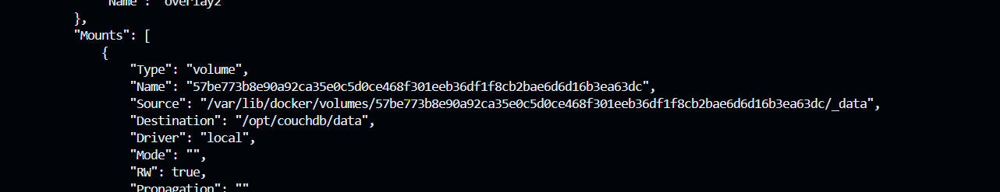
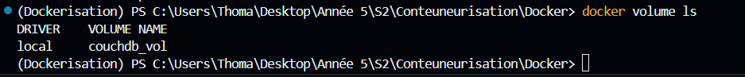
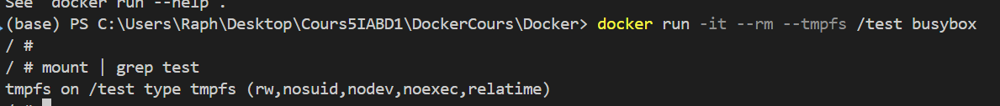
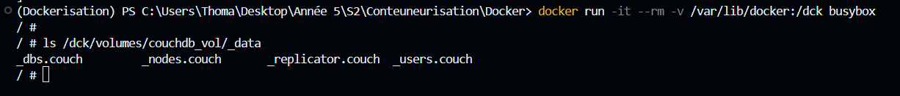

# Lab 3 - Volumes

## Use volumes

### Tips

- Use `docker container inspect ...`

### Existing volumes

1. run `docker container run --name couchdb -d -p 5984:5984 couchdb:2.1`
2. Check existing volumes 
Command: docker volume ls
   1. Why there is already a volume ? 
   There's already a volume because the CouchDB image is designed to store its data in a volume beyond the life of the container
3. Identify the volume that is used by `couchdb` 
Command: docker container inspect couchdb 
Then we look at the mounts part: 

4. Mount the identified volume to busybox 
Command: docker run -it --rm --volumes-from couchdb busybox
5. Check files inside `/opt/couchdb/data` 
Command : ls /opt/couchdb/data

6. Stop couchdb 
Command: docker stop couchdb
7. Delete the volume 
Command: docker volume rm 57be773b8e90a92ca35e0c5d0ce468f301eeb36df1f8cb2bae6d6d16b3ea63dc
8. Check that the volume has been deleted  
 
Already created the named volume of the next part

### Create a named volume

1. Create a volume named : `couchdb_vol` 
Command: docker volume create couchdb_vol
2. Run `couchedb` with the created volume 
Command: docker run --name couchdb -d -p 5984:5984 -v couchdb_vol:/opt/couchdb/data couchdb:2.1
3. Inspect the container and look at `Mounts` that `couchdb_vol` is used 
Command: docker container inspect couchdb 

### Mount directory

1. Mount `/var/lib/docker` from host to `/dck` into a busybox container  
Command: docker run -it --rm -v /var/lib/docker:/dck busybox
2. Check at `ls /dck/volumes/couchdb_vol/_data` inside the container to verify that `couchdb_vol` is available 
docker run -it --rm -v /var/lib/docker:/dck busybox 

### SideCar Pattern

1. Create a directory named `sidecar` with `mkdir` 
Command: mkdir sidecar
2. Run Busybox
   1. Command: `sh -c 'while true; do date >> /dck/date.log; sleep 1; done'`
   2. Volume to mount: `$(pwd)/sidecar:/dck`
   3. Name: `gen_date`
   4. State: detached 
Command: docker run -d --name gen_date -v C:\Users\Thoma\sidecar:/dck  busybox sh 'while true; do date >> /dck/date.log; sleep 1; done' 
3. Check the content of `sidecar/date.log` with `cat` 
No date log to show, i had issues with the dck path in Windows.
4. Run Busybox
   1. Command: `tail -f /dck2/date.log`
   2. Volume to mount: `$(pwd)/sidecar:/dck2`
   3. State: attached 
   Command: docker run -it --rm -v C:\Users\Thoma\sidecar:/dck2 busybox tail -f /dck2/date.log
5. Check content of `dck2/date.log` with `tail -f`
   #  It's being continuously updated.
6. Exit container
   # I used ctrl+c to exit
7. Run `docker kill gen_date`
   1. Why is the container stoped ? 
   The docker kill command sends a SIGKILL signal to the specified container, forcing it to stop.

### In memory 

1. Run busybox with `--tmpfs /test` 
docker run -it --rm --tmpfs /test busybox
2. Check with `mount | grep test` that tmpfs is used 
   # mount | grep test
   # tmpfs on /test type tmpfs (rw,nosuid,nodev,noexec,relatime)

