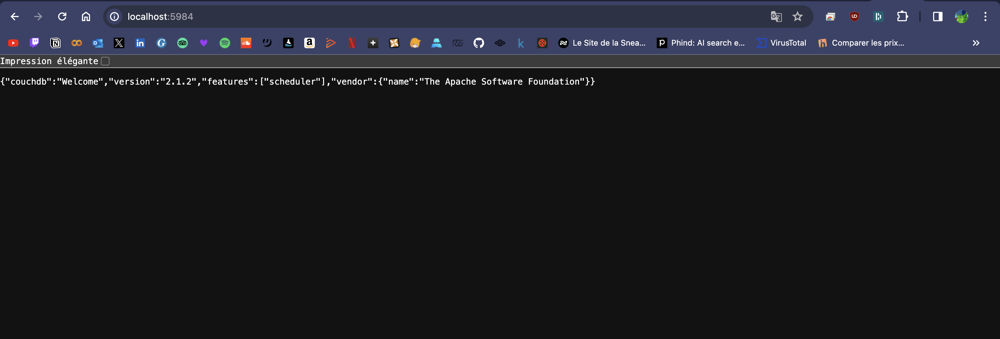
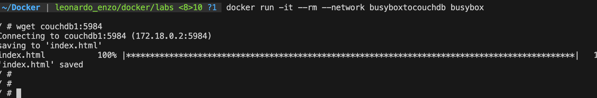

# Lab 3 - Network

## Expose port

### Tips

- Port must be higher than 1024

### Expose port

1. Pull `couchdb:2.1`
Terminal: docker pull couchdb:2.1
2. Run couchdb, name it `couchedb1` and expose the port `5984` (detached)
Terminal: docker run -d --name couchdb1 -p 5984:5984 couchdb:2.1
3. Check the couchedb version on `http://localhost:5984`

4. Run temporary busybox container
Terminal: docker run -it --rm busybox
5. Call `localhost:5984` with `wget` from busybox container
   1. What happened ?
   wget: can't connect to remote host (127.0.0.1): Connection refused
   2. Why ?
   busybox is in a private network and can't acces to localhost network
6. Call `couchdb1:5984` with `wget` from busybox container
   1. What happened ?
   wget: bad address 'couchdb1:5984'
   2. Why ?
   docker try to find couchdb1 name but it not available in the busybox's network
7. Create a new network named `busyboxtocouchdb`
Terminal: docker network create busyboxtocouchdb
8. Connect `couchdb1` to the network with `docker network connect ...`
Terminal: docker network connect busyboxtocouchdb couchdb1
9. Re-run busybox connected to the same network
10. Call `couchdb1:5984` with `wget` from busybox container
it's working !!
