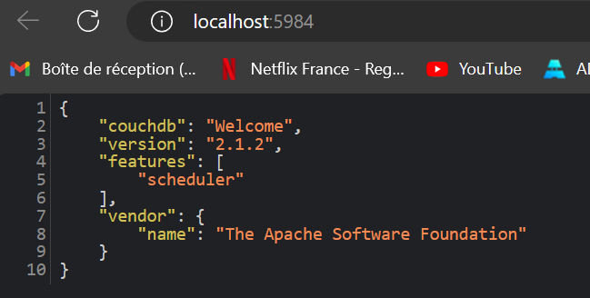

# Lab 3 - Network

## Expose port

### Tips

- Port must be higher than 1024

### Expose port

1. Pull `couchdb:2.1`
   Command: docker pull couchdb:2.1
2. Run couchdb, name it `couchedb1` and expose the port `5984` (detached)
   Command: docker run -d -p 5984:5984 --name couchdb1 couchdb:2.1
3. Check the couchedb version on `http://localhost:5984` 
   
4. Run temporary busybox container
   Command: docker run -it --rm busybox
5. Call `localhost:5984` with `wget` from busybox container
   Command: wget localhost:5984
   1. What happened ?
   Connection refused.
   2. Why ?
   localhost in the busybox container does not serv the host where couchdb1 is running.
6. Call `couchdb1:5984` with `wget` from busybox container
   Command: wget couchdb1:5984
   1. What happened ?
   bad address 'couchdb1:5984'
   2. Why ?
   couchdb1 and busybox container are not recognizing themselves because they are in isolated networks.
7. Create a new network named `busyboxtocouchdb`
   Command: docker network create busyboxtocouchdb
8. Connect `couchdb1` to the network with `docker network connect ...`
   Command: docker network connect busyboxtocouchdb couchdb1
9. Re-run busybox connected to the same network
   Command: docker run -it --rm --network busyboxtocouchdb busybox
10. Call `couchdb1:5984` with `wget` from busybox container
   Command: wget couchdb1:5984
